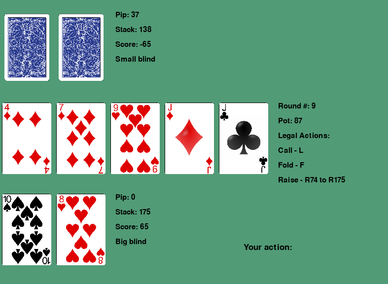

# pokerbots-interactive
Made for 2022 MIT Pokerbots.

We can now show that we are better than our own bots!


## Usage
It's just like a normal pokerbot! 
`engine.py` is the same as the default, so you may either clone the whole repository and put your bot inside, or just download the human folder.

Note that config.py should be modified to use the human bot, and these timing parameters should be set as follows: 
```
ENFORCE_GAME_CLOCK = False
CONNECT_TIMEOUT = 100000.
```

## Gameplay
Just type an action (legal actions are on the right) and hit return to submit it. 


